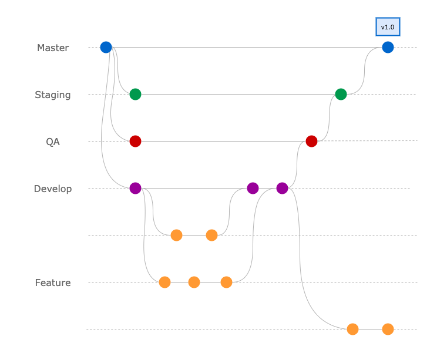
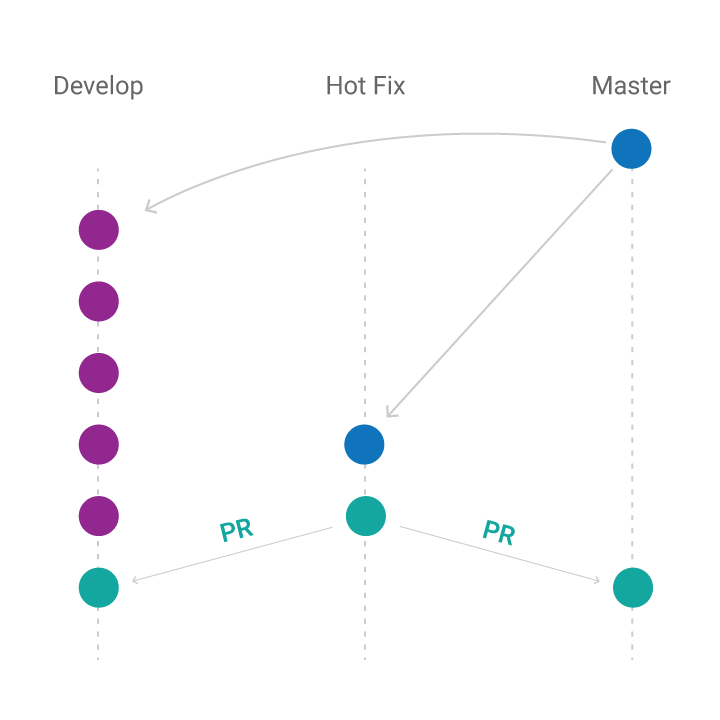

# Git Workflow

En nuestro trabajo diario aplicamos diferentes guías de estilos y estandarizaciones que nos ayudan a tener un criterio unificado en relacion a diferentes tecnologías. El objetivo de este documento es crear un estándar a nivel empresa para el workflow de git en los diferentes proyectos.

Los lineamientos descriptos en este documento tienen variadas ventajas. Entre ellas, nos permite manejar la misma nomenclatura facilitando la incorporación de otros integrantes al equipo y promueve la mejor organización de los proyectos. Asimismo, ayuda a definir soluciones para algunos problemas habituales. Finalmente, el workflow planteado esta enfocado a mantener un historial confiable que refleje el estado del proyecto.

A continuación, listaremos el contenido de este documento. Algunos de los lineamientos son de carácter obligatorio y deben ser seguidos en el desarrollo de cualquier proyecto. Los contenidos de carácter obligatorio serán resaltados con la etiqueta  **[Required]**. Si bien el resto de los lineamientos no son obligatorios, son altamente recomendables.

* [Versión en Inglés](./README.md)

## Contenido

- [Manejo de branches](#manejo-de-branches)
  - [Previo salir a producción](#previo-salir-a-producci%C3%B3n)
    - [Develop branch (develop)](#develop-branch-develop--requerida)
    - [Staging branch (staging)](#staging-branch-staging-requerida)
    - [QA branch (qa)](#qa-branch-qa-opcional)
    - [Feature branch (feature/x)](#feature-branch-featurex)
    - [Fix branch (fix/x)](#fix-branch-fixx)
    - [Enhancement branch (enhancement/x)](#enhancement-branch-enhancementx)
    - [Feedback branch (feedback/x)](#feedback-branch-feedbackx)
    - [Demo branch (demo)](#demo-branch-demo)
  - [Post salida a producción](#post-salida-a-producción)
    - [Master branch (master)](#master-branch-master-required)
    - [Release branch (release_branch_x)](#release-branch-release_branch_x-required)
      - [Integración de Release branch a master y develop](#integraci%C3%B3n-de-release-branch-a-master-y-develop)
    - [Feedback branch (feedback/x)](#feedback-feedbackx)
    - [Hotfix branch (hotfix/sign-up)](#hotfix-hotfixsign-up-requerida)
- [Manejo de Releases](#manejo-de-releases)
  - [Previo salir a producción](#previo-salir-a-producci%C3%B3n-1)
  - [Post salida a producción](#post-salida-a-producción-required)
    - [Primera salida a producción](#primera-salida-a-producci%C3%B3n)
    - [Posteriores salidas a producción](#posteriores-salidas-a-producci%C3%B3n)
      - [Nueva versión (Major)](#nueva-versión-major)
      - [Arreglo de bugs (PATCH)](#arreglo-de-bugs-patch)
      - [Cambios menores (MINOR)](#cambios-menores-minor)

# Manejo de branches

## Previo salir a producción

En esta sección se explica el manejo de cada una de las branches involucradas en el proceso de desarrollo previo a salir a producción.

### Develop branch (develop)  **[Requerida]**

Es la branch principal, refleja la integración de todo el trabajo del equipo durante la etapa de desarrollo del proyecto.
Es la branch base hasta salir a producción por primera vez.

* **Origen:** *master* (cuando se inicia el proyecto, es creada desde master)
* **Destino:** -
* **Casos de uso:** Integración del trabajo del equipo.

### Staging branch (staging) **[Requerida]**

Esta branch contiene todas las funcionalidades listas para ser testeadas por el Cliente.

Si el proyecto tiene CD configurado, cada vez que algo sea mergeado en esta branch el código será automáticamente deployado al ambiente de Staging para que el Cliente pueda probarlo.

* **Origen:** *master* (cuando se inicia el proyecto, es creada desde master)
* **Destino:** -
* **Casos de uso:** Integración del trabajo hecho por el equipo de desarrollo ya testeado y aprobado por el equipo de QA, listo para ser revisado por el Cliente.

### QA branch (qa) **[Opcional]**

Esta branch contiene todas las funcionalidades listas para ser testeadas por el equipo de QA.

Si el proyecto tiene CD configurado, cada vez que algo sea mergeado en esta branch el código será automáticamente deployado al ambiente de QA.

* **Origen:** *master* (cuando se inicia el proyecto, es creada desde master)
* **Destino:** *staging*
* **Casos de uso:** Integración del trabajo hecho por el equipo de desarrollo listo para ser testeado por el equipo de QA.

**_Nota_**: *Si una de las funcionalidades mergeadas en QA no está lista para ser promovida a la branch Staging, los ajustes necesarios (eliminar la funcionalidad/deshabilitar el acceso a la misma/etc) deben ser realizados en la branch Develop, para luego ser promovidos a la branch QA y así continuar con el flujo.*

  

### Feature branch (feature/x)

Esta branch contiene una funcionalidad o parte de una en la que se está trabajando actualmente. Una vez completado el trabajo, se crea un Pull Request a develop y luego de finalizar el proceso de review es mergeada a develop.

_Ejemplo: feature/sign-up_

* **Origen:** *develop*
* **Destino:** *develop*
* **Casos de uso:** Funcionalidad durante desarrollo.

### Fix branch (fix/x)

Esta branch es creada para el arreglo de un bug durante la etapa de desarrollo.

_Ejemplo: fix/sign-up-error-messages_

* **Origen:** *develop*
* **Destino:** *develop*
* **Casos de uso:** Bug durante desarrollo.

### Enhancement branch (enhancement/x)

Esta branch es creada para agregar una mejora durante la etapa de desarrollo sobre alguna funcionalidad que ha sido mergeada previamente a la branch development.

_Ejemplo: enhancement/users-retrievement-query_

* **Origen:** *develop*
* **Destino:** *develop*
* **Casos de uso:** Agregar mejora durante desarrollo.

### Feedback branch (feedback/x)

Esta branch es creada para trabajar en feedback de una determinada funcionalidad.

_Ejemplo: feedback/sign-up-change-inputs-order_

* **Origen:** *develop*
* **Destino:** *develop*
* **Casos de uso:** Feedback del cliente o cualquier integrante del equipo de una determinada funcionalidad durante desarrollo.

### Demo branch (demo)

Esta branch tiene dos objetivos:

1. No afectar el proceso de code review.
2. Mostrar el avance del equipo en la review con el cliente.

Branch temporal creada a partir de develop en la cual se mergea el contenido de otras branches que aún no estan prontas para ser integradas a develop. El único propósito de esta branch es enteramente dedicado a la demo, por lo que debe ser descartada inmediatamente despues de la realización de la misma.

* **Origen:** *develop*
* **Destino:** - (borrar branch)
* **Casos de uso:** Mostrar todas las funcionalidades desarrolladas hasta el momento en la instancia de review, no importa si ya estan completadas o no.
Para poder mergear una branch a develop, es obligatorio que la misma pase por un adecuado proceso de code review, sin embargo, es frecuente que al momento de la review, la branch aun no este completa o el PR aun no haya sido aprobado. Para esto, todas las branches que van a ser mostradas en la review, pueden ser mergeadas automáticamente en la branch temporal demo, sin necesidad de code review.

Si se realizan cambios en las branches, se puede mergear de nuevo ese cambio en la branch *demo* o crear de nuevo la branch temporal si hay un cambio en un commit (*git amend*) o en la historia (*git rebase*).

*Nota: a pesar de ser una branch que tiene como finalidad mostrar el avance en una review, no es recomendable enviar una versión a partir de esta branch. En estos casos, hablar con el referente del proyecto o algunos de los referentes de la empresa.*

*Es recomendable hacer el deploy de esta branch a un ambiente previo a staging, como puede ser development. Ver: manejo de environments en base a git workflow (documento en construcción).*

  

## Post salida a producción

En esta sección se explica el manejo de cada una de las branches involucradas en el proceso de desarrollo post salida a producción.

A no ser que la branch sea nuevamente explicada en esta sección, las anteriores branches detalladas en la sección *Previo salir a producción*, deben seguir siendo utilizadas de la misma manera.

Con el manejo de branches detallado a continuación, se busca mantener el historial de commits, siempre y cuando sea posible.
Por esta razón, para poder mantener las branches actualizadas entre si, no se utilizan enfoques clásicos basados en el uso de *cherry-pick* y *merge*. De lo contrario, se prioriza el uso de *rebase*.

### Master branch (master) **[Required]**

Esta branch refleja el estado de producción, siempre debe estar en un estado estable.

Por esta razón, las nuevas funcionalidades continúan siendo desarrolladas a partir de *develop* y son integradas a master una vez que se encuentran funcionando y son aprobadas por el cliente en un ambiente de prueba.

* **Origen:** -
* **Destino:** -
* **Casos de uso:** Reflejar producción

### Release branch (release_branch_x) **[Required]**

Esta branch es creada conteniendo las nuevas funcionalidades que quieren ser agregadas al ambiente de producción.

Su función es separar el desarrollo de nuevas funcionalidades que quieren ser agregadas a producción de otras que aún no están prontas o simplemente aún no quieren ser liberadas por el equipo o el cliente.

Debe ser liberada por primera vez a un ambiente de prueba utilizado por el cliente y el feedback proveniente del mismo será agregado a esta branch.

El momento en que debe ser creada depende del proyecto y el equipo.
En equipos con varios integrantes es recomendando crearla al momento que se comienza a desarrollar la primer feature de la versión.
Por otra parte, en equipos con pocos integrantes es recomendable crearla una vez completadas las funcionalidades que quieren ser liberadas. Este es el caso más común en la empresa.

* **Origen:** *develop*
* **Destino:** *master*
* **Casos de uso:** Luego de liberada la branch a un ambiente de prueba, puede existir feedback del cliente o encontrarse bugs. Estos arreglos deben ir a la release branch y no a develop.
De esta manera, si en simultáneo otro dev comenzó a trabajar en funcionalidades futuras y lo integró a *develop*, se evita liberar funcionalidades que no pertenecían a la release actual. Además, nos permite mantener un orden en el tiempo en relación a que vamos a liberar próximamente.

#### Integración de Release branch a master y develop

Luego de que la release branch está pronta para ser liberada a producción, la misma debe ser integrada a master y también a develop.

***Master***

Directamente a través de un Pull Request que es creado desde la release a **master**. Idealmente, cada uno de los commit de este Pull Request ya pasaron por un proceso de code review, por lo cual, no es necesario repetir el review para mergear, simplemente asegurarse que todo se encuentra de acuerdo a lo planeado y funcionando correctamente.

***Develop***

La release branch, puede además contener commits que no se encuentran en develop, comúnmente, aquellos que surgieron luego de feedback del cliente y fueron integrados a la release y no a develop.

Para mantener **develop** actualizado, se debe hacer un rebase con *origin master* y luego un push a develop desde develop local.

A continuación se detallan los comandos adecuados:

1. `git checkout develop`
2. `git pull origin develop:develop` para así actualizar *develop* local con *origin/develop*.
3. `git rebase -i origin/master` para actualizar el historial de develop con respecto a origin/master.
4. `git push origin develop:develop` para actualizar origin/develop.

### Feedback (feedback/x)

Esta branch es creada para trabajar en el feedback de una funcionalidad.

_Ejemplo: feedback/sign-up-change-inputs-order_

* **Origen:** *release branch*
* **Destino:** *release branch*
* **Casos de uso:** Feedback del cliente o interno de una determinada funcionalidad luego de liberada una release branch a un ambiente de prueba.

### Hotfix (hotfix/sign-up) **[Requerida]**

Estas branches son no planeadas, son creadas para solucionar bugs o cambios críticos, que no deben ser mezclados con el actual desarrollo (*develop* branch).

No confundir con bugs de desarrollo, estos últimos van contra *develop* o una release branch. Además, no todos los bugs son hotfixes, solo aquellos que se priorizan como críticos y afectan directamente una funcionalidad importante del sistema.

El cambio también debe estar presente en develop. Por lo cual, es **responsabilidad del desarrollador** **que creó el commit** que una vez que el Pull Request es mergeado en master, **inmediatamente** el commit también se encuentra en la branch *develop.*

Para esto, se deben seguir los mismos pasos detallados en la subsección **integración de release branch a master y develop** para la branch develop.

* **Origen:** *master*
* **Destino:** *master*
* **Casos de uso:** Bugs o cambios críticos de producción.

  

# Manejo de Releases

En esta sección se explica cómo manejar releases previo y post salida a producción. Comenzando con una breve explicación del porqué y las ventajas que nos brinda el manejo de las mismas.

**_¿Que es?_**

Una Release es un link a una versión con un conjunto de notas que describen los cambios con respecto a la última versión.

Las versiones se manejan utilizando tags, las cuales se crean automáticamente al crear una release. Las tags son fotos inmutables de una branch.

**_Ventajas_**

Manejar versiones sprint a sprint o post salida a producción nos permite manejar el trabajo de forma ordenada y tener un trackeo confiable de que versiones se encuentran en staging y principalmente en producción.

## Previo salir a producción

Una vez finalizado el sprint y solucionado el feedback proveniente del cliente se crea una release.
Ver [https://help.github.com/articles/creating-releases/](https://help.github.com/articles/creating-releases/)

* **Origen:** develop
* **Versión:** v0.x, donde x es el número del sprint en el cual se está trabajando.
* **Título:** Release sprint x, donde x es el número del sprint.
* **Descripción:** detalle de las funcionalidades desarrolladas durante desarrollo.

_Nota: el manejo de releases previo salir a producción es altamente recomendado pero no obligatorio._

## Post salida a producción **[Required]**

El manejo de Releases luego de salir a producción es por demás importante dado que nos permite tener una captura inmutable de lo que hay en producción.
En este caso, la tag se crea desde *master*. Por ejemplo, luego de mergear una branch hotfix o release a master.

### Primera salida a producción

La primera vez que que se libera a producción se debe mergear el contenido de la branch *develop* en *master*. Luego, la release es creada.

* **Origen:** master
* **Versión:** v1.0
* **Título:** Release v1.0
* **Descripción:** detalle de las funcionalidades desarrolladas durante desarrollo.

### Posteriores salidas a producción

En posteriores releases a producción se recomienda el estándar MAJOR.MINOR.PATCH.

#### Nueva versión (Major)

Se liberan un conjunto de funcionalidades que no son compatibles con la versión anterior o un conjunto muy grande de funcionalidades que pueden marcar un gran cambio desde el punto de vista del negocio.

* **Origen:** master
* **Versión** : (vMAJOR + 1).0.0
* **Título:** Release (vMAJOR + 1).0.0
* **Descripción:** descripción general de la nueva versión y detalle de las nuevas funcionalidades desarrolladas

#### Cambios menores (MINOR)

Versión que introduce cambios compatibles con la versión anterior.
En este caso, dado que se liberan un conjunto de nuevas funcionalidades y arreglo de bugs no críticos, se incrementa en uno el valor MINOR para generar la nueva versión.

* **Origen:** master
* **Versión** : vMAJOR.(MINOR + 1).0
* **Título:** Release vMAJOR.(MINOR + 1).0
* **Descripción:** detalle de las nuevas funcionalidades desarrolladas y bugs que fueron solucionados.

#### Arreglo de bugs (PATCH)

Contiene uno o más arreglos de bugs. Independientemente de si los mismos son urgentes o no.
Comúnmente, si los bugs no son urgentes, se espera a solucionar un conjunto de bugs para liberar una nueva versión.
En caso de que el bug sea urgente, es necesario liberar una versión cuanto antes.

* **Versión** : vMAJOR.MINOR.(PATCH + 1)
* **Título:** Release vMAJOR.MINOR.(PATCH + 1)
* **Descripción:** detalle de los bugs arreglados que son considerados importantes.
